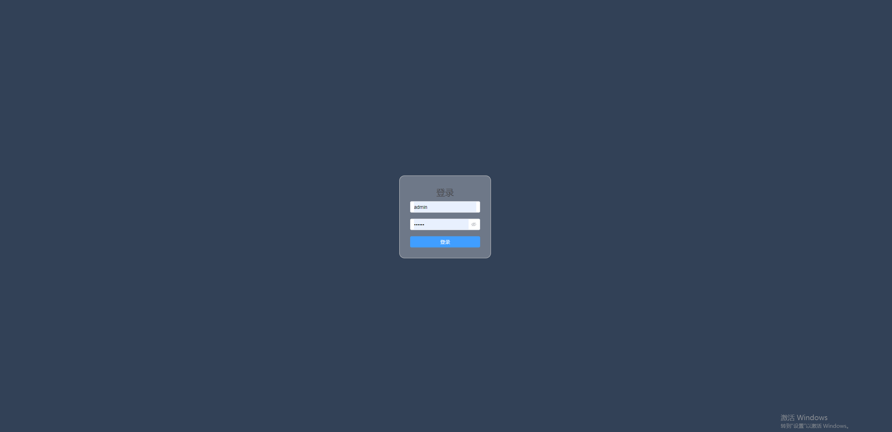
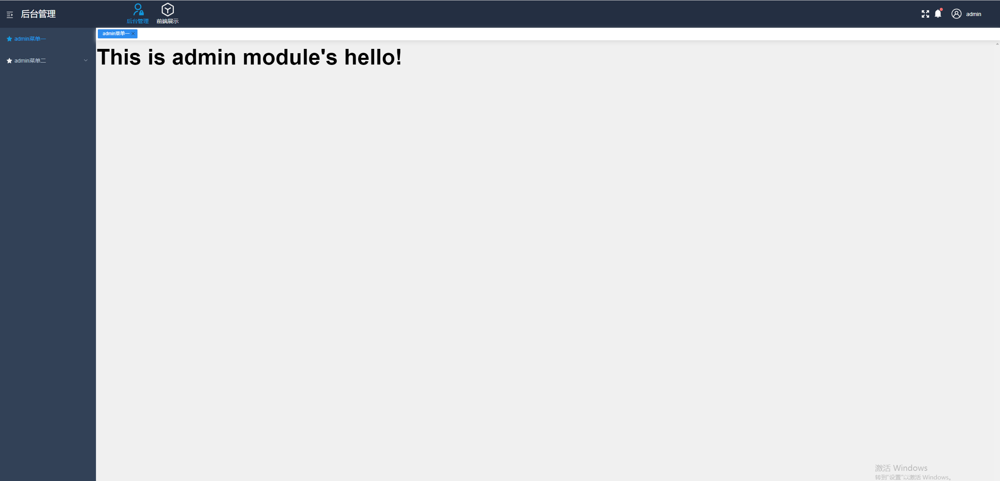
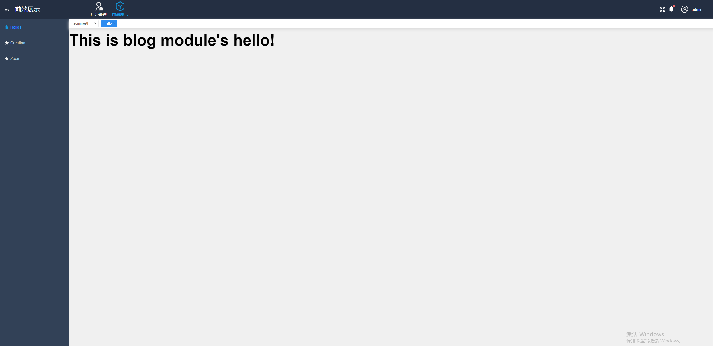

# vue3-manage
此项目一套基于`vue3` + `element-plus`构建的允许添加多个单独子系统的管理框架。所有子系统拥有独自的`layout`，`router`信息，系统会在进入子系统时自动根据`router`生成菜单。

## 说明
系统中的数据暂时通过`mock`生成。
# 技术栈
`vue3` `pinia` `vue-router` `vite` `scss` `element-plus`

# 项目运行
```js
git clone https://github.com/li1615882553/vue3-manager.git

cd vue3-manage  

npm install 

npm run dev

访问: http://localhost:5173
```

# 部分截图



